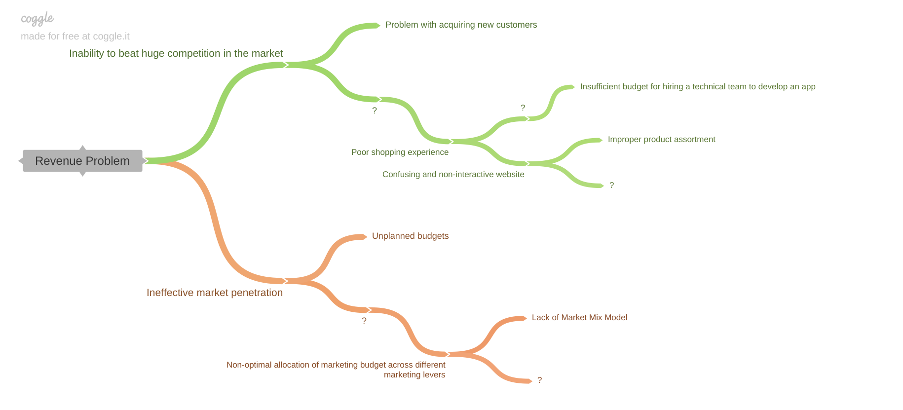

# Market-Mix-Modeling-Capstone-Project

## Problem Statement: Part - I

### Background  - Business Understanding

ElecKart is a leading e-commerce chain based in Ontario, Canada, specialising in electronic products. It sells all major electronic items such as TVs, cameras, OLED screens, and microwaves. The company follows the marketplace model and acts as a platform where buyers and sellers can interact with each other. Sellers can put various products on the website, and buyers purchase these products from them. The company serves as a technology provider for a free but regulated marketplace and deals with all the top-end and low-end brands to cater to different types of customers.

 

The company has a huge network across the country and has partnered with multiple courier companies to deliver their products to customers in every possible corner of the country. It sells these products only via the website and occasionally offers big-ticket promotions (similar to the Big Billion Day) in order to ensure that the top-end customers are delighted. The company has established several quality checks to ensure the timely delivery of the products and notify the end customers of each intermediate step till the final product is delivered to their doorstep. Detailed feedback is also requested on the products and services in order to further improve customer experience.

 

The following major entities are involved in the end-to-end operations for any ElecKart business chain:

1. Category managers: They curate the assortment of products on the website. They add information related to the products on the website and define the sections on how the products are grouped for a better user experience. For example, there will be one category manager for the Electronics category and another for Fashion, and so on. They display products in an appealing manner on the website and decide the product range with proper price planning to suit the target customer’s needs.
2. Onboard Team: They look out for merchants with whom the company can do business and get them on board. They validate their authenticity, do all the paperwork, and handle the agreements.
3. Sellers: Sellers supply the goods and products that are to be sold on the e-commerce platform. Note that marketplace models do not own the goods themselves. These types of models are engaged in selling goods produced by suppliers.
4. Warehouse: Generally, companies maintain their own warehouse, but they can also depend on the sellers for it. The sellers stock their products in the warehouse in advance, for which companies charge them some amount. When an order is placed for a product, the product is directly shipped from the warehouse of the company. This helps the company better regulate the quality checks.
5. Logistic partners: They play an important role in the delivery and return of goods. They are also responsible for collecting the payment from customers for COD orders.
6. Online e-commerce platform: This plays an important role in facilitating the sale and purchase of goods and services offered by the sellers to the customers.
7. Customers: Customers visit the website, examine the goods stocked on the shelves and make the final purchase according to their needs.
8. Customer care team: This team helps the customers and merchants with their product or delivery issues.
 

The brand has shown commendable growth in just a few years of its operation. However, over the last one year, ElecKart has faced a revenue dip even after spending a significant amount of money on marketing and promotions. There was a high customer churn ratio because the company was failing to understand customer demographics and cater to the needs of their customers. There was no mobile app for a satisfactory shopping experience and the website had a confusing interface with incomplete product details making it difficult for the customers to easily locate what they are looking for. The budgets planned were not as impactful as expected, and the CFO was quite unhappy with the turnover rates. Now, the CFO wants a root cause analysis done to understand what went wrong in the process and why they were unable to hit the desired profit levels. The company would like to optimise its operations in order to ensure better cost efficiencies and not lose the existing customer base due to lack of planning and operational flaws.

 

Now, suppose you are working at an e-commerce service consultant firm, and you are tasked with understanding the problem and making recommendations about how ElecKart’s end-to-end operations can be optimised. You are required to spend a couple of weeks collecting facts and data about ElecKart’s operations and investigate this incident to find the possible root causes for the underlying issue.

Let’s dive into the root cause analysis using the 5 Whys or the issue tree framework based on ElecKart’s business model and the issue tree provided below.

Create the above issue tree chart on Coggle and fill the empty boxes with a question mark based on your understanding and the hints provided before and after these blanks. You need to determine the root cause of the problem by understanding the 'Why' of each of these sub-root causes in the given tree and submit your solution as a pdf file downloaded from Coggle.

## Problem Statement: Part - II
After performing the root cause analysis to understand the problems faced by ElecKart, your team has decided to meet the Head of Marketing to validate whether their approach and analysis were going in the right direction or not. This is needed to be done because your consulting firm wants to dig deeper into the problem, understand its implications, and arrive at an effective solution that would help ElecKart emerge out of its current scenario. 

Apart from the budget optimisation challenge, you have analysed that the company also has a low order conversion rate because customers hardly spend time on the website and end up not shopping for anything. So, your team strikes up a conversation with the head of marketing and explains how serious the current situation is, and if this trend continues, the company will not only fail to acquire new customers but also lose the existing customers, resulting in a huge turndown. Before directly pitching the possible solutions for the problem, your team needs to build the implications and the need payoff of the problem. This would enable the company to pay heed to the unhappy customers and other underlying issues of improper stock utilisation and its overall turnover rates.

 

Conversation Exchange between the consulting firm(CF) and the head of marketing, ElecKart(EK)

 

CF: So, it sounds like the problem is that ElecKart does not have a mobile application to facilitate the sale and purchase of goods between the sellers and the customers?  
EK: Yes, that is correct. We are currently operating our business through the website, which is not really giving us satisfactory results due to its current design and lack of user-friendly nature.

 

CF: What have your customers rated your website?
EK: Well, we performed a thorough analysis of our website’s performance with the help of the A/B testing team, and they reported that our website is quite heavy and confusing in the sense that customers are unable to find what they are looking for.

 

CF: Oh, that’s an alarming situation indeed. This means your customers must be quite unhappy about this.  
EK: Yes, they actually are unhappy. Many of them simply browse through our website and leave without shopping for anything because they are unable to locate the required products. Some of them add certain products into their cart but do not proceed further because of how complex the checkout and payment process is.

 

CF: So, what do you think, is the average time spent by the customers on your portal, and how much is the order conversion rate among the customers who visit and browse your website?  
EK: The average time spent by our customers is around 12 seconds, and out of these customers, we have experienced merely a 30% order conversion rate, which is something we are really worried about.

 

CF: It seems like the existing customers are churning at high rates. What does it take to acquire new customers?  
EK: It is quite difficult to acquire new customers because it requires a humongous investment. As you already know, ElecKart is a start-up and has just started stretching out its wings and stepping out into the competitive market. So, it would take a lot more effort to acquire new customers than retaining the existing customers by improving their satisfaction levels and catering to their requirements in the best possible manner.

 

CF: How do you strategise to retain the existing customers with higher churning rates?  
EK: Well, that’s a good question. Whenever we identify that an existing customer, especially a dormant account holder with just one order history, is going to churn, we offer them promo codes, cashbacks, and free deliveries so that they can get higher discounted rates than other competitors and can be encouraged to stay with us.

 

CF: Customers with lower conversion rates might actually be affecting your stocks and making inventory management quite difficult for you.  
EK: That is absolutely correct. Many of these customers add products to their carts but do not proceed any further, thereby making the products unavailable for those who need it. This adds another unhappy customer to the list.

 

CF: This means that your stock utilisation and management is getting highly compromised, which is leading to lower turnover rates.  
EK: Seems like this website is literally causing me pain in the neck, and I need to set up a technical team to develop a mobile application to boost our revenue and profits.

 

Based on your team’s conversation with the head of marketing at ElecKart, your task is to fill the SPIN table. Using the transcription above as a reference, identify at least three situations, the problems, the implications, and the need-payoffs for the business.

## Problem Statement: Part - III
Now that you have developed various hypotheses for the issues faced by ElecKart, let’s consider one among them, the lack of market mix modelling. As a data scientist or an analyst working for ElecKart, you need to develop a market mix model based on the given information and the data sets related to consumer purchases, monthly spends on advertising channels, climatic information and the NPS/stock index.

### Data Understanding
You have to use the data from July 2015 to June 2016. The data consists of the following types of information:

 

Order level data

- FSN ID: The unique identification of each SKU
- Order Date: Date on which the order was placed
- Year/Month: Year and month when the order was placed
- Order ID: The unique identification number of each order
- Order Item ID: When the customer orders two different products at the same time, the system generates two different order Item IDs under the same order ID. Note that orders are tracked using Order Item IDs.
- GMV: Gross merchandise value or revenue
- Units: Number of units of the specific product sold
- deliverybdays: Number of business days between the placement of the order and the final delivery day
- deliverycdays: Number of calendar days between the placement of the order and the final delivery day
- Order Payment Type: How the payment was made, whether prepaid or cash on delivery
- SLA: Number of days it typically takes to deliver the product
- Cust id: Unique identification of a customer
- pincode: Pin location from where the order was placed
- product_analytic_super_category: Super category to which the product belongs
- product_analytic_category: Category to which the product belongs
- product_analytic_sub_category: Sub-category to which the product belongs
- product_analytic_vertical: Assortment vertical to which the product belongs
- Product MRP: Maximum retail price of the product
- Product procurement SLA: Time typically taken to procure the product
 

Apart from this, the following information is also available:

- Monthly spend on various advertising channels
- Days when there was any special sale on products
- Monthly NPS score (this may work as a proxy to the ‘voice of the customer’)
- Stock index of the company on a monthly basis 
- Climatic information of Ontario during 2015 and 2016

### Project Pipeline
The project pipeline can be briefly summarised in the following steps:

 

#### Data Preparation
You have to create market mix models for three product subcategories: Camera Accessory, Home Audio, and Gaming Accessory. Also, the models must be built at a weekly level for each of the subcategories.

#### Feature Engineering
As the e-commerce company is based in the Ontario region, we will need to include its climate data to analyse whether it has any effect on the company’s revenue. Create as many features as possible with the available data.

 

Note: Create separate columns for Pay Date (if the first or fifteenth of the month) and holidays by creating a flag as a 0 or 1. For example, if it’s a holiday, the value will be 1.

 
#### Exploratory Data Analysis
Perform univariate analysis, bivariate analysis, correlations, cross-tabs, and create visualisations on the pre-analytical data set. Obtain insights and shortlist variables for modelling. Create the KPIs according to the requirement of the model and write appropriate comments for choosing those KPIs.

#### Model Building and Evaluation
Build basic, logarithmic, and multiplicative models or any other possible model with the available data set and fine-tune their hyperparameters until you get the desired level of performance. Analyse the impact of various attributes on the target variable using appropriate metrics. 

 

#### Presentation of Results
Choose the best results of the market mix model for each of the three product subcategories and create a PowerPoint presentation along with a video explaining the analysis and results to the relevant business stakeholders such as CMO/CFO.

 

The audience should be able to intuitively understand the model/analysis that you have built/performed and its financial impact on the business. Point out any surprising or unexpected trends that you notice.
